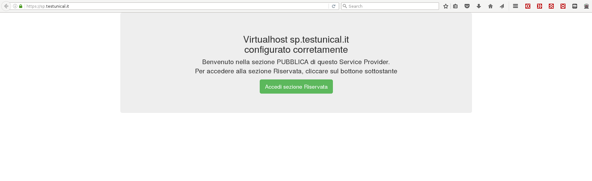
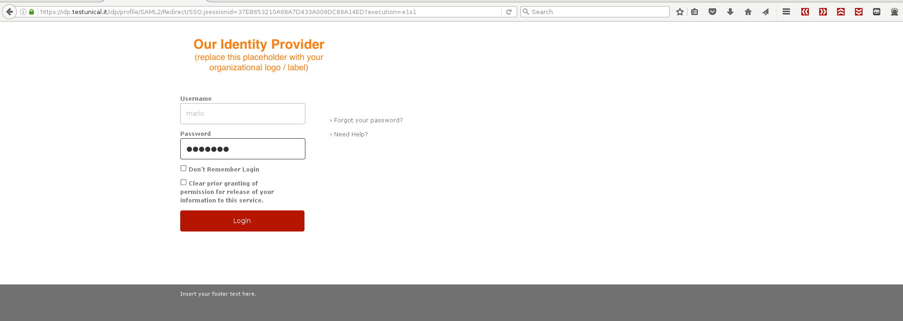
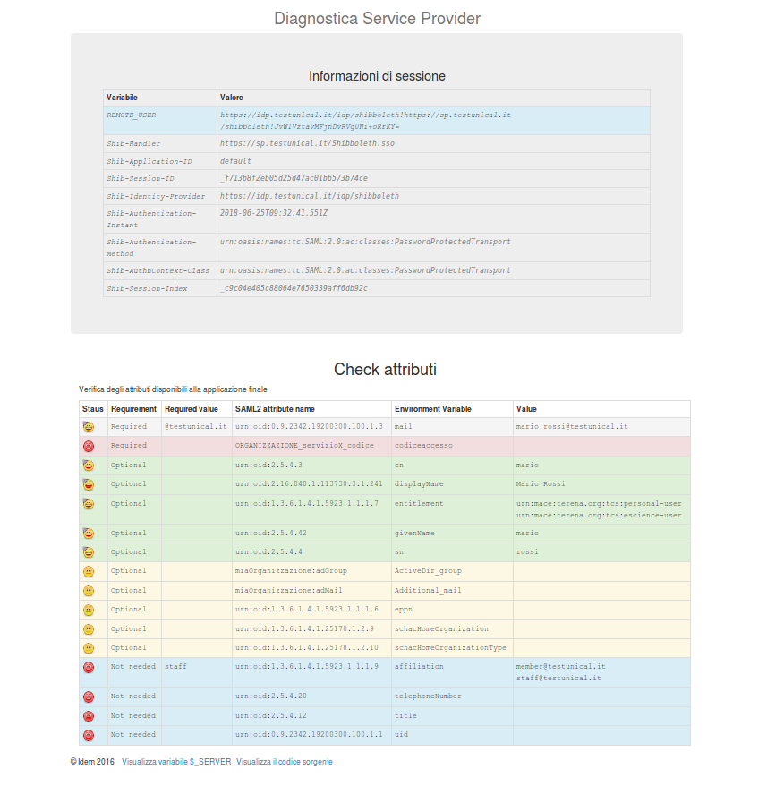

[Ansible playbook] 

Shibboleth IDPv3 SP2 Debian 9 
=============================

Setup in locale di ShibbolethIdP 3 e Shibboleth SP 2 con i seguenti servizi:

- Servlet Container per IDP (tomcat8 o jetty9, default: tomcat8)
- apache2    (HTTPS frontend)
- mod_shib2  (Application module for shibboleth sp)
- shibboleth (Identity provider)
- mariaDB    (IDP persistent store)

La versione di Java utilizzata è OpenJDK 8.

Parametri ed opzioni utili:

- shib_idp_version: 3.3.2. Testato anche con 3.2.1, richiede attribute-resolver.v3-idem.xml
- idp_attr_resolver, il nome del file di attributi da copiare come attribute-resolver.xml dell' IDP
- idp_persistent_id_rdbms: true. Configura lo storage dei Persistent ID su MariaDB e ottine REMOTE_USER nella diagnostica della pagina SP
- servlet_container: tomcat | jetty.
- idp_disable_saml1: disabilita il supporto a SAML versione 1
- servlet_ram: 384m. Quanta ram destinare al servlet container

Requisiti
---------

- Installazione preesistente di OpenLDAP, come illustrato nella sezione "Guida all'uso"
- Utente LDAP abilitato per le ricerche nella uo di interesse (esempio consultabile in ldap/idp_user.ldiff)
- ACL LDAP per le query dell'IDP (esempio consultabile in ldap/idp_acl.ldiff)
- Installazione delle seguenti dipendenze

````    
aptitude install python3-pip python-dev libffi-dev libssl-dev libxml2-dev libxslt1-dev libjpeg-dev zlib1g-dev
pip3 install ansible
````

Guida all'uso
---------
Se non hai una installazione funzionante di LDAP puoi crearne una così:
````
git clone https://github.com/peppelinux/ansible-slapd-eduperson2016
cd ansible-slapd-eduperson2016

# nano playbook.yml 

# modifica le variabili di make_ca.sh prima di creare le chiavi, specialmente l'hostname del server ldap altrimenti le connessioni SSL falliranno!
nano make_ca.sh 
bash make_ca.sh

# questo comando rimuove precedenti installazioni di LDAP
ansible-playbook -i "localhost," -c local playbook.yml -e '{ cleanup: true }'

# installiamo e configuriamo quindi il nostro LDAP
ansible-playbook -i "localhost," -c local playbook.yml

# testare la connessione ad LDAP da un client remoto
# accertati che l'hostname del server LDAP sia presente in /etc/hosts oppure che questo possa essere risolto dal tuo DNS.
nano /etc/hosts

# accertati che in /etc/ldap/ldap.conf sia stato configurato TLS_CACERT con il certificato del tuo CA, esempio:
TLS_CACERT /etc/ssl/certs/testunical.it/slapd-cacert.crt

# aggiungi l'utente idp
ldapadd -Y EXTERNAL -H ldapi:/// -D "cn=admin,dc=testunical,dc=it" -w slapdsecret -f ldap/idp_user.ldiff

# aggiungi una ACL per consentire la connessione e la ricerca all'utente idp
ldapmodify -Y EXTERNAL -H ldapi:/// -D "cn=admin,dc=testunical,dc=it" -w slapdsecret -f ldap/idp_acl.ldiff

# testiamo che l'utente idp effettivamente possa interrogare il server LDAP
ldapsearch -H ldap://127.0.0.1 -D "uid=idp,ou=applications,dc=testunical,dc=it" -w idpsecret  -b 'ou=people,dc=testunical,dc=it'

# controlliamo/modifichiamo le variabili del nostro playbook ed eseguiamolo
# i nomi dei certificati rimangono costanti, in caso di modifica conviene riutilizzare gli stessi nomi

ansible-playbook -i "localhost," -c local playbook.yml

````

Puoi creare delle chiavi firmate di esempio con make_ca.sh, basta editare le variabili all'interno del file secondo le tue preferenze.

````
nano make_ca.sh

````

Il seguente esempio considera una esecuzione in locale del playbook:

````
ansible-playbook -i "localhost," -c local playbook.yml [-vvv]
````

Risultato
---------





LDAP Troubleshooting
---------

E' sempre meglio testare la connessione ad LDAP prima del setup.
Da verificare oltre ai certificati anche le ACL di slapd.

````
ldapsearch  -H ldaps://ldap.testunical.it:636 -D "uid=idp,ou=applications,dc=testunical,dc=it" -w idpsecret  -b 'uid=mario,ou=people,dc=testunical,dc=it' -d 220
````
Se torna errore: TLS: hostname (rt4-idp-sp.lan) does not match common name in certificate (ldap.testunical.it).
Soluzione: allineare i certificati e la corrispondenza commonName con l'hostname del server.


Esclusivamente per scopo di test è possibile eludere la validazione del certificato con il seguente comando, al fine di escludere ulteriori variabili.
````
LDAPTLS_REQCERT=never ldapsearch  -H ldaps://ldap.testunical.it:636 -D "uid=idp,ou=applications,dc=testunical,dc=it" -w idpsecret  -b 'uid=mario,ou=people,dc=testunical,dc=it' -d 220
````

Troubleshooting
---------
````
net.shibboleth.utilities.java.support.component.ComponentInitializationException: Injected service was null or not an AttributeResolver
````
In tomcat8/jetty logs: la connessione al datasource fallisce (ldap/mysql connection/authentication error) oppure un errore sintattico in attribute-resolver.xml (o quali abilitati in services.xml)

--------------------------------

````
opensaml::FatalProfileException

Error from identity provider: 
Status: urn:oasis:names:tc:SAML:2.0:status:Responder
````
Probabilmente manca la chiave pubblica dell'SP presso l'IDP, oppure le chiavi presentano, localmente, permessi di 
lettura errati. L'IDP preleva il certificato dall'SP tramite MetaDati. Se questo errore si presenta e i certificati sono stati adeguatamente definiti in shibboleth2.xml... Hai ricordato di riavviare shibd? :)

---------------------------------

````

"Request failed: <urlopen error ('_ssl.c:565: The handshake operation timed out',)>"
````
TASK [mod-shib2 : Add IdP Metadata to Shibboleth SP]
libapache2-mod-shib2 non contiene i file di configurazione in /etc/shibboleth (stranezza apparsa su una jessie 8.0 aggiornata a 8.7). 
Verificare la presenza di questi altrimenti ripopolare la directory

---------------------------------

````
opensaml::SecurityPolicyException
Message was signed, but signature could not be verified.
````
L'SP ha i metadati dell'IDP errati/disallineati. Soluzione:

````
cd /etc/shibboleth/metadata
wget --no-check-certificate https://idp.testunical.it/idp/shibboleth

# verificare che siano effettivamente differenti !
diff shibboleth idp.testunical.it-metadata.xml 
rm idp.testunical.it-metadata.xml 
mv shibboleth idp.testunical.it-metadata.xml 
# nessun riavvio è richiesto

# controllare inoltre che i certificati del sp siano leggibili da _shibd
chown _shibd /etc/shibboleth/sp.testunical.it-*

````

--------------------------------------

````
java.lang.NoClassDefFoundError: org/apache/commons/pool/ObjectPool
...
Cannot resolve reference to bean 'MyDataSource' while setting bean property 'dataSource'
...
Failed to instantiate [org.apache.commons.dbcp.BasicDataSource]: No default constructor found
````
manca commons-pool.jar in /opt/jetty/lib/ext oppure al posto di commons-pool.jar hai installato commons-pool2.jar

-------------------------------------
````
Caused by: org.springframework.beans.factory.BeanCreationException: Error creating bean with name 'authn/IPAddress' defined in file [/opt/shibboleth-idp/system/conf/../../conf/authn/general-authn.xml]:
....
Cannot resolve reference to bean 'shibboleth.DefaultAuthenticationResultSerializer' while setting bean property 'resultSerializer'; nested exception is org.springframework.beans.factory.BeanCreationException: Error creating bean with name 'shibboleth.DefaultAuthenticationResultSerializer' defined in file [/opt/shibboleth-idp/system/conf/general-authn-system.xml]:
....
Instantiation of bean failed; nested exception is org.springframework.beans.BeanInstantiationException: Failed to instantiate [net.shibboleth.idp.authn.impl.DefaultAuthenticationResultSerializer]: Constructor threw exception; nested exception is javax.json.JsonException: Provider org.glassfish.json.JsonProviderImpl not found
````
manca javax.json-api-1.0.jar in /opt/jetty/lib/ext
Test confgurazioni singoli servizi/demoni

----------------------------
````
 Cannot resolve reference to bean 'shibboleth.metrics.AttributeResolverGaugeSet' while setting bean property 'arguments'
````
L'eccezione emerge lungo il parse del file general-admin-system.xml, al bean id="shibboleth.metrics.AttributeResolverGaugeSet".
Riferimento ML shibboleth-users: http://shibboleth.1660669.n2.nabble.com/Update-IdP3-3-0-error-td7629585.html
Controllare ldap.properties e attribute-resolver.xml, con molta probabilità c'è un errore di connessione al server LDAP.

---------------------------
````
2018-03-05 13:38:13,259 - INFO [org.opensaml.saml.common.binding.impl.SAMLMetadataLookupHandler:128] - Message Handler:  No metadata returned for https://sp.testunical.it/shibboleth in role {urn:oasis:names:tc:SAML:2.0:metadata}SPSSODescriptor with protocol urn:oasis:names:tc:SAML:2.0:protocol
````
Copiare i metadati dell'SP (wget --no-check-certificate https://sp.testunical.it/Shibboleth.sso/Metadata) in /opt/shibboleth-idp/metadata.


Systems checks
---------
````
# jetty status
service jetty check

# apache2 configuration test
apache2ctl configtest

# You can test that the IdP is properly installed and is at least running successfully in the container with the status command line utility 
export JAVA_HOME=$(readlink -f /usr/bin/java | sed "s:bin/java::")
/opt/shibboleth-idp/bin/status.sh 

# shibboleth sp test
shibd -t

# idp and sp https checks
openssl s_client -connect sp.testunical.it:443
openssl s_client -connect idp.testunical.it:443
````
---------------------

Todo
---------

- Integrazione slapd overlay PPolicy con Shibboleth (gestione dei lock, esposizione di questo layer a livello idp)
- Implementare multiple sources per attributi da RDBMS differenti
- ruolo per SP con nginx
- Apache2/Tomcat2 hardening
- implementare ruolo/opzioni per setup Attribute Authority, con e senza autenticazione
- JRE selezionabile: openJDK, Oracle
